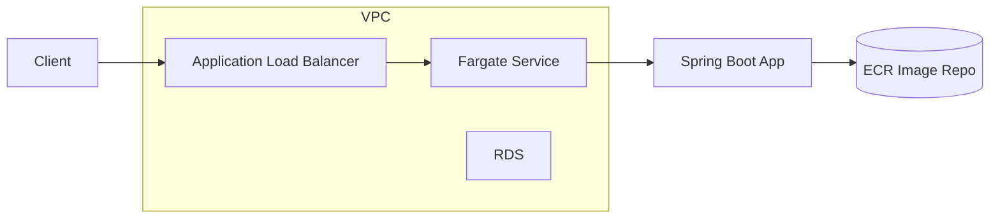
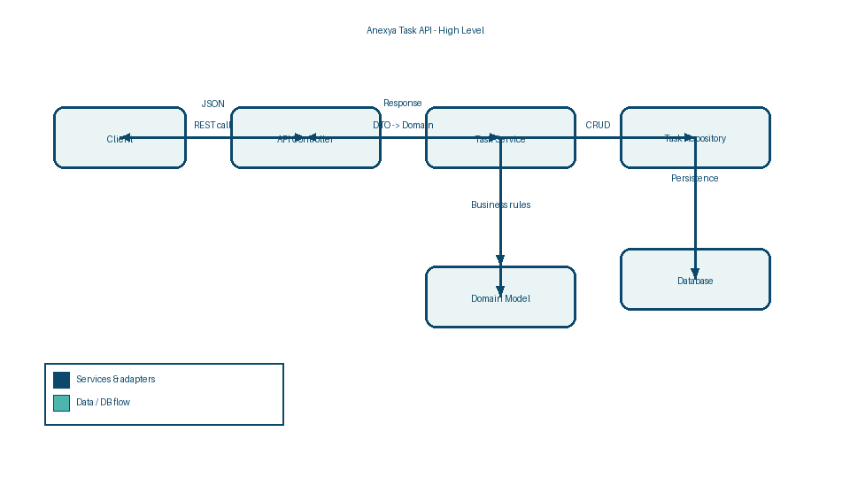

# Anexya SaaS Challenge

Monorepo with a Java 21 Spring Boot Tag Read API and AWS infrastructure defined with the AWS CDK (TypeScript).

## Prereqs
- Java 21
- Gradle 8+ (or generate the wrapper with `gradle wrapper` inside `api/`)
- Node 18+
- AWS CLI configured with credentials and a target account/region

## API (Java 21, Spring Boot)
- Location: `api/`
- Current state: Tag Read ingestion + aggregation endpoints (in-memory by default, JDBC/MySQL under `mysql` profile).

### Run locally (in-memory)
```bash
cd api
./gradlew test
./gradlew bootRun
```

### Run locally with MySQL
```bash
cd api
./gradlew bootRun --args='--spring.profiles.active=mysql' \
	--mysql.host=localhost --mysql.port=3306 --mysql.db=tagreads --mysql.user=appuser --mysql.password=secret
```
Environment variables also work: `MYSQL_HOST`, `MYSQL_PORT`, `MYSQL_DB`, `MYSQL_USER`, `MYSQL_PASSWORD`.

### REST surface
- `POST /api/tag-reads` — create a tag read (site, epc, referenceCode, location, rssi, readAt)
- `GET /api/tag-reads` — list reads
- `GET /api/tag-reads/{id}` — fetch by id
- `GET /api/tag-reads/summary/by-epc?startDate=...&endDate=...&siteName=...&epc=...` — aggregate by EPC

### API docs (Swagger / OpenAPI)
- JSON: `GET /v3/api-docs`
- UI: `GET /swagger-ui.html`

#### Viewing Swagger locally
1. Start the app (in-memory):
	```bash
	cd api
	./gradlew bootRun
	```
2. Open Swagger UI: http://localhost:8080/swagger-ui.html
3. Download OpenAPI JSON: http://localhost:8080/v3/api-docs

## Infrastructure (AWS CDK v2, TypeScript)
- Location: `infra/`
- Provisions: VPC, ECS cluster, ECR repo (`anexya-api`), RDS MySQL (8.0), ALB-backed Fargate service (port 80 -> 8080), ALB health check `/actuator/health`. ECS tasks get DB host/port/db as env vars and username/password from Secrets Manager.

### CDK usage
```bash
cd infra
npm install
npm run build
npm run synth   # preview
npm run deploy  # deploys AnexyaInfraStack
```

### Deploying the API image
1) Build and push the Spring Boot image to the created ECR repo `anexya-api` (replace the URI from the stack output):
```bash
cd api
./gradlew bootJar
docker build -t <ACCOUNT>.dkr.ecr.<REGION>.amazonaws.com/anexya-api:latest .
aws ecr get-login-password --region <REGION> | docker login --username AWS --password-stdin <ACCOUNT>.dkr.ecr.<REGION>.amazonaws.com
docker push <ACCOUNT>.dkr.ecr.<REGION>.amazonaws.com/anexya-api:latest
```
2) `cd infra && npm run deploy` to roll out the new image.

## Operations guide
- **Health**: `/actuator/health` (ALB target health check), `/actuator/metrics`, `/actuator/info`.
- **Profiles**: default = in-memory; `mysql` = JDBC to RDS/MySQL. Set `SPRING_PROFILES_ACTIVE=mysql` in ECS task env for production.
- **Secrets**: DB credentials are stored in Secrets Manager; injected into the task as `MYSQL_USER` and `MYSQL_PASSWORD`.
- **Scaling**: ECS service CPU autoscaling (1–4 tasks, target 70%). Adjust in `infra/lib/anexya-infra-stack.ts`.
- **Logging**: Standard Spring Boot logging to stdout; aggregate via CloudWatch Logs from ECS.
- **Backups**: RDS automatic snapshots as per AWS defaults (can be customized in the stack).

## Architecture
See below for the high-level diagram and component notes. A copy also lives in `docs/architecture.md`.




