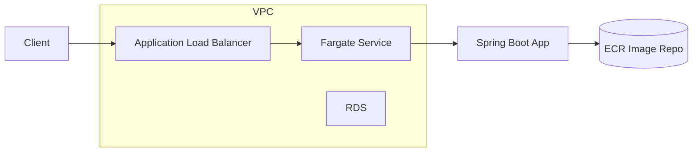

# Anexya Monorepo

Java 21 Spring Boot Tag Read API plus AWS CDK (TypeScript) infrastructure. Profile: `mysql` (JDBC + Flyway).

## Prerequisites
- Java 21
- Gradle wrapper
- Node 18+
- Docker (buildx for multi-arch/amd64 on Apple Silicon)
- AWS CLI configured with an account/region

## API (folder: `api/`)
- Spring Boot 3.2, Lombok, MapStruct, Flyway, MySQL Testcontainers for integration tests.
- Virtual threads enabled (`spring.threads.virtual.enabled=true`).

### Run locally with MySQL
```bash
cd api
./gradlew bootRun --args='--spring.profiles.active=mysql' \
	--mysql.host=localhost --mysql.port=3306 --mysql.db=tagreads --mysql.user=appuser --mysql.password=secret
```
Environment variables also work: `MYSQL_HOST`, `MYSQL_PORT`, `MYSQL_DB`, `MYSQL_USER`, `MYSQL_PASSWORD`.

> Schema: for the `mysql` profile, automatic schema init is disabled; apply `schema-mysql.sql` manually (or via migrations) to create `tag_reads` before first run.

> TLS: the JDBC URL uses `sslMode=REQUIRED` to keep TLS on while skipping hostname/CA verification (useful in ECS when the RDS CA bundle isn’t present). For stronger verification, change to `sslMode=VERIFY_CA` (requires RDS CA in truststore) or `sslMode=VERIFY_IDENTITY` (also checks hostname).

### Schema & Flyway
- Prod `mysql` profile: migrations in `src/main/resources/db/migration/mysql` (partitioned `tag_reads`).
- Tests use `src/test/resources/db/migration/testmysql` (non-partitioned) via `spring.flyway.locations` in tests.

### Endpoints (port 8080)
- `POST /api/tag-reads`
- `GET /api/tag-reads/{id}`
- `GET /api/tag-reads/search?epc=...&location=...&siteName=...`
- `PUT /api/tag-reads/{id}`
- `DELETE /api/tag-reads/{id}`
- `GET /api/tag-reads/summary/by-epc?startDate=...&endDate=...&siteName=...&epc=...`

### API docs
- JSON: `/v3/api-docs`
- UI: `/swagger-ui.html`

### Packaging & Docker
```bash
cd api
./gradlew -PskipTests=true bootJar
docker build -t anexya-api:local .
```

## Infrastructure (folder: `infra/`, AWS CDK v2)
Provisions VPC, ECS Fargate service (port 8080, ALB health `/actuator/health`), RDS MySQL 8, and ECR repo.

### Deployment flow (ECR first, then push image, then app stack)
1) Deploy ECR stack (creates the repo):
```bash
cd infra
npm run deploy -- AnexyaEcrStack --profile <PROFILE> --parameters EcrRepositoryName=anexya-api-app
```
2) Build and push the Spring Boot image to that repo (replace `<ACCOUNT>`, `<REGION>`, repo if different):
```bash
cd api
./gradlew -PskipTests=true bootJar

# create/use a buildx builder once
docker buildx create --name cross --use || docker buildx use cross

# build and push amd64 (for ECS/Fargate)
ECR_URI=<ACCOUNT>.dkr.ecr.<REGION>.amazonaws.com/anexya-api-app
docker buildx build --platform linux/amd64 -t $ECR_URI:latest --push .

# optional: multi-arch
# docker buildx build --platform linux/amd64,linux/arm64 -t $ECR_URI:latest --push .
```
3) Deploy the app stack to roll out the image:
```bash
cd infra
npm run deploy -- AnexyaInfraStack --profile <PROFILE> --parameters EcrRepositoryName=anexya-api-app
```

4) Schema migrations (mysql profile)
	- Flyway runs automatically on app startup. Migration scripts live in `api/src/main/resources/db/migration/mysql/`.
	- The RDS endpoint and creds come from stack outputs and Secrets Manager. You can fetch them if you need to run Flyway manually:
		```bash
		REGION=us-east-1
		STACK=AnexyaInfraStack

		RDS_ENDPOINT=$(aws cloudformation describe-stacks --stack-name $STACK \
		  --region $REGION --query "Stacks[0].Outputs[?OutputKey=='RdsEndpoint'].OutputValue" --output text)

		SECRET_NAME=$(aws secretsmanager list-secrets --region $REGION \
		  --query "SecretList[?contains(Name, 'DbCredentials')].Name | [0]" --output text)

		aws secretsmanager get-secret-value --secret-id "$SECRET_NAME" --region $REGION \
		  --query SecretString --output text
		```
	- Optional: run migrations manually from inside ECS via exec (keeps traffic in VPC): install mysql client, then run Flyway CLI or apply SQL as needed.

## Operations
- **Profiles**: `mysql` (set in the stack).
- **Health**: `/actuator/health` (ALB target health check), `/actuator/metrics`, `/actuator/info`.
- **Schema**: Flyway runs automatically on startup for the `mysql` profile (migrations in `db/migration/mysql`).
- **Secrets**: DB credentials are stored in Secrets Manager; injected into the task as `MYSQL_USER` and `MYSQL_PASSWORD`.
- **Access logs**: Every request is logged (method, path, status, latency) to stdout; when profile `aws` is active, the same fields are emitted to CloudWatch via `access_log` events.
- **Scaling**: ECS service CPU autoscaling (1–4 tasks, target 70%). Adjust in `infra/lib/anexya-infra-stack.ts`.
- **Logging**: Standard Spring Boot logging to stdout; aggregate via CloudWatch Logs from ECS.
- **Backups**: RDS automatic snapshots as per AWS defaults (can be customized in the stack).

## Architecture
