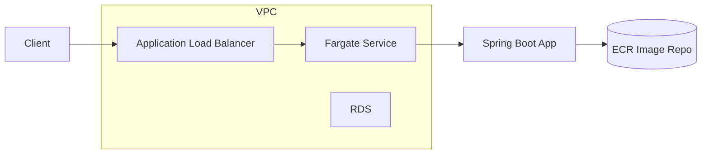

# Architecture

Components:
- **Client**: callers of the REST API.
- **ALB**: public entry, health checks `/actuator/health`.
- **ECS/Fargate**: runs the Spring Boot application that ingests and aggregates tag reads.
- **RDS MySQL**: stores tag reads when the `mysql` profile is active (table `tag_reads`).
- **ECR**: container image registry consumed by ECS service.
